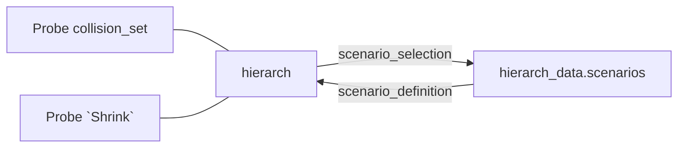

`hierarch_data.gd`  contains

- a dictionary called `shapes` that defines all the `SDFShapes`
- a dictionary called `scenarios` that defines the conditions for adding and removing sdfShapes from the world

`scenarios` returns a given scenario 

collision_set : objects the probe is colliding with. Probe location, basically.

scenarios provide enough data to build out the entire world for a given collision_set