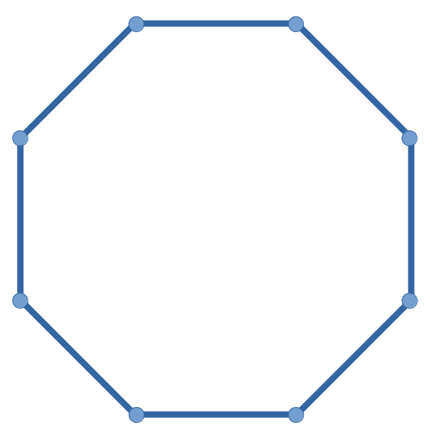
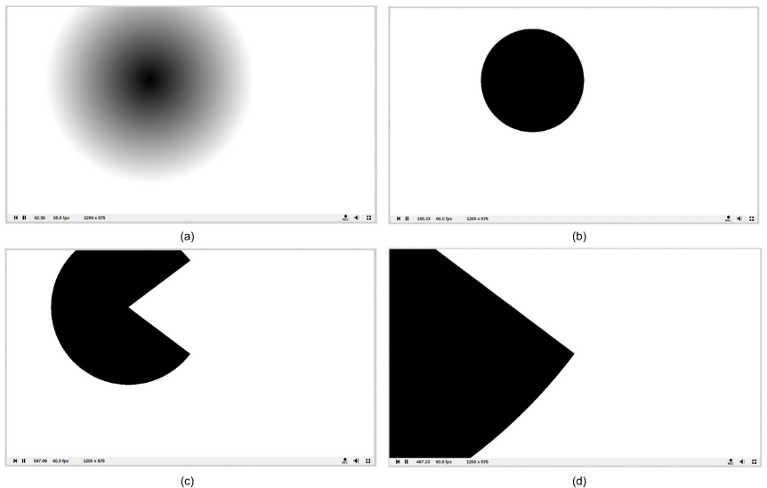
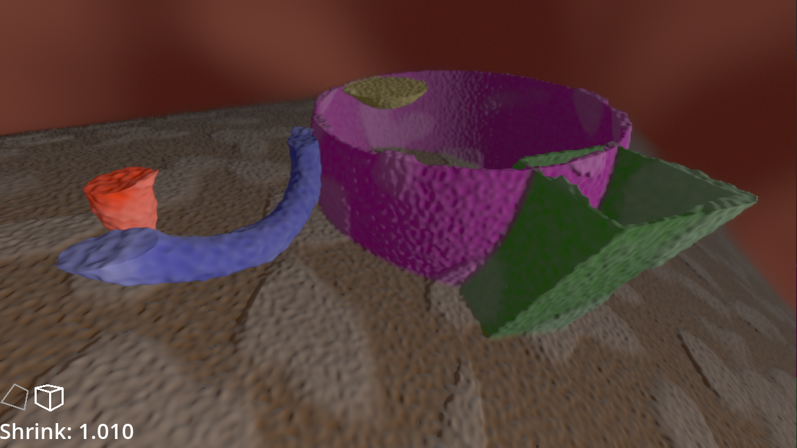

*This article is written to provide a general audience with a foundational understanding of the main graphical technique used in Corpusim.*

The standard graphics pipeline is a sequence of steps that a 3D object passes through to be rendered on a screen. The 3D object, called a mesh, is made of triangles defined by vertices and edges between them. This mesh is sent through a vertex shader (shader being a program that runs in a graphics card), that can manipulate each vertex. The mesh is then transformed into pixels, known as fragments, and sent to the fragment shader which calculates the color of each pixel. Finally, the fragments are blended together and sent to the frame buffer to be displayed on the screen.

Explicit modeling, as in the standard pipeline, means that some points on the object’s boundary are explicitly listed, and then lines are drawn between those points.

Implicit modeling, by contrast, creates a 3D object by defining functions that imply the boundary of the object’s geometry. This mathematical function can be used to generate a smooth surface analytically and with no need for a mesh. Implicit modeling offers more flexibility and higher accuracy than explicit modeling, enabling nearly infinite magnification and instantaneous modification of geometry, but is more computationally expensive. Figure 1 shows the difference between a circle defined by 8 explicit points (a) and a circle defined by a radius (b).

|   |   |
|---|---|
|||
|(a)|(b)|

Figure 1. Implicit vs. explicit definition of a circle.

In the first experimental prototype for Corpusim’s graphics engine, prior to March 2022, the implicit model was converted to an explicitly defined mesh by using the marching cubes algorithm. That introduced performance problems due to the rapidly changing shapes present in human physiology, as well as the varying levels of detail required for meshes as magnification increased. The geomorphing technique was considered for resolving the latter problem, but ultimately a pure SDF rendering engine was chosen to succeed the first approach.

### 2D SDF

Signed Distance Functions (SDFs) describe geometry implicitly. Shapes are determined at render time, entirely in the fragment shader, using mathematical parameters in a ray tracing algorithm. Consequently, the geometric shape does not have a resolution; it can be accurately rendered at any scale. As an analogy, consider 2D rasterized vs. vector graphics.

An SDF is a mathematical function that takes a 2D point as input and returns the signed distance from that point to the closest boundary of a shape. SDFs can generate a wide range of shapes and effects by distorting SDF coordinates (with noise, for example) or boolean operations.

Figure 2. Screenshots of an online SDF demonstration.

  

In Figure 2, the gradient seen in (a) is the expression of distance to a position in the upper left; greater distance is more white. With a step function, we achieve the sharp boundary of (b). A boolean subtraction operation—cutting off a piece of the existing geometry—is shown at 1.5x (c) and 10x (d) magnification.

Any level of magnification on any region of the shape maintains the highest visual fidelity due to the shape’s implicit definition. Boolean operations maintain this perfect resolution.

The effect of magnification is best to observe in a live, animated demonstration, so the graphics of Figure 2 are available to [view online](https://www.shadertoy.com/view/Ddd3Rj). The code-savvy reader is encouraged to learn about SDFs through play; any modifications to the online shader will show in the render pane after pressing the play button (►) or <kbd>alt</kbd> + <kbd>Enter</kbd>

### 3D SDF

The 2D concepts of SDFs translate to 3D: A given position in space will determine its distance to the nearest geometry and use that information to render the scene.

The standard approach to rendering a scene defined by 3D SDFs is called sphere tracing, or ray marching. Sphere traced SDFs allow for efficient processing of extraordinarily detailed 3D shapes–a feat unattainable using traditional polygonal models. Sphere tracing is also used in optimized methods of finding SDF normals, which enables lighting calculations and the appearance of depth.

A running example of 3D SDF shader code is available online.

As with 2D SDFs, boolean operations cost almost nothing in performance. That functionality has great utility for Corpusim because the cutaway view is an essential element of anatomy study. 

Figure 3 shows a recent screenshot of Corpusim’s prototype SDF engine. The top portion of every object has been sliced away with a boolean subtraction operation. The texture is created with noise applied at two octaves of fractal repetition. The open source repository for the graphics research prototype is online (Corpusim, “RDT SDF Engine”). 

Figure 3. Screenshot of Corpusim’s prototype RDT SDF Engine.

## PCG

Fractals are a good starting point to understand procedural content generation (PCG).

A fractal is a type of mathematical object that has a repeating structure at different scales. The appearance is often irregular, but there is still some underlying scaling law. By setting a few parameters, such as the size and complexity of the fractal, it is possible to generate an infinite number of unique shapes and structures. Fractals are found throughout nature, with examples including the structure of snowflakes, lightning, and galaxies. However, Benoit Mandelbrot, who pioneered the field, commented “If you have a hammer, use it everywhere you can, but I do not claim that everything is fractal.” Accordingly, other tools are more prevalent in PCG, often just taking cues from the mathematics of fractals.

Noise is a type of randomness that can be used in procedural content generation. Gaussian noise, also known as white noise, is a sort of “pure” random noise with a normal distribution. Gaussian noise is rarely used for interactive graphics because the natural phenomena being simulated resemble smooth, continuous shapes. Other noise algorithms, such as Perlin noise and Worley noise, are widely used to create realistic terrain and natural environments.

Random input, user input, and other external input sources are frequently used to drive PCG algorithms. This initial content is then combined with predetermined rules, such as the rules of the video game or the desired visual design elements, to create a unique experience for the user.

Several hugely successful video games of recent decades have employed PCG to varying degrees. One prominent example is Minecraft, with its infinitely stretching voxel worlds.

## Data-Driven SDF PCG

Edward Tufte offers a principle for producing better graphical tools: The reasoning capabilities of users are amplified by improving the quality, relevance, and integrity of the data being presented.

Biological and medical databases are available on the internet and can provide data for use in Corpusim. The National Center for Biotechnology Information (NCBI) is an online repository of biological data that includes a range of databases with information on genes, proteins, and disease. NCBI also provides access to sequence data, gene expression data, and genome annotation data.

With the proliferation of big data infrastructure, the availability of data is no challenge. The structures and management of data as it applies to Corpusim, however, is a research topic.