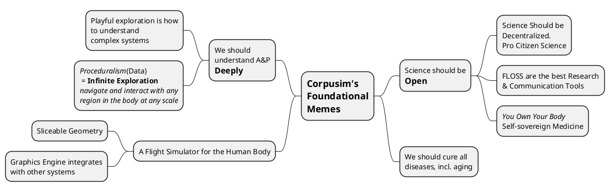

## Corpusim's Foundational Memes

These are the ideas and objectives that guide the Corpusim Project

```plantuml
@startmindmap


right side
* = Corpusim's\n=Foundational\n= Memes

** Science should be\n==Open
*** Science Should be\nDecentralized.\nPro Citizen Science
*** FLOSS are the best Research\n& Communication Tools
*** //You Own Your Body//\nSelf-sovereign Medicine
** We should cure all\ndiseases, incl. aging

left side

** We should \nunderstand A&P\n==Deeply
*** Playful exploration is how\nto understand\ncomplex systems
*** //Proceduralism//(Data)\n = **Infinite Exploration**\n//navigate and interact with any//\n//region in the body at any scale//

** A Flight Simulator for the Human Body
*** Sliceable Geometry
*** Graphics Engine integrates\nwith other systems

@endmindmap

```

