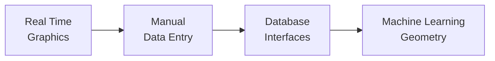
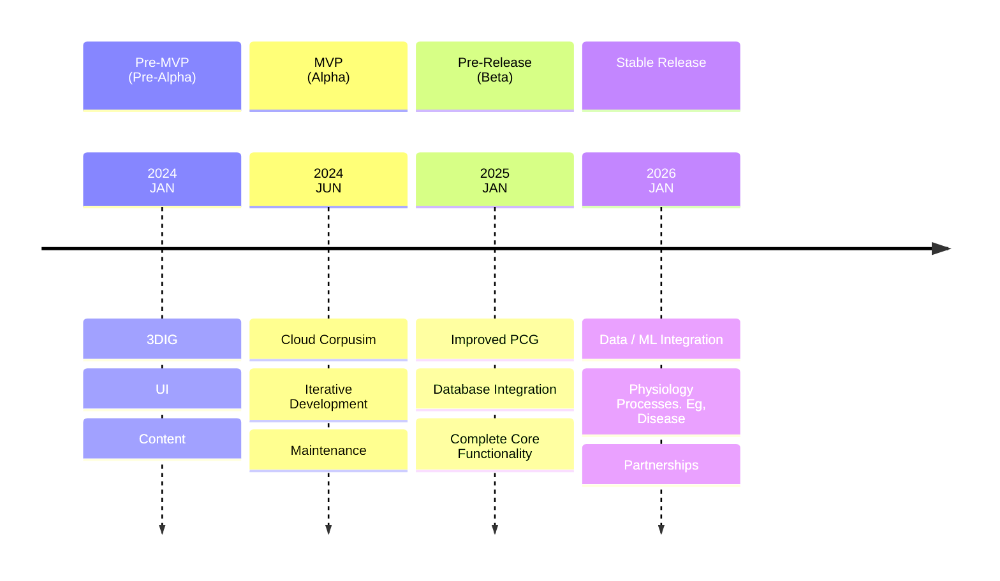
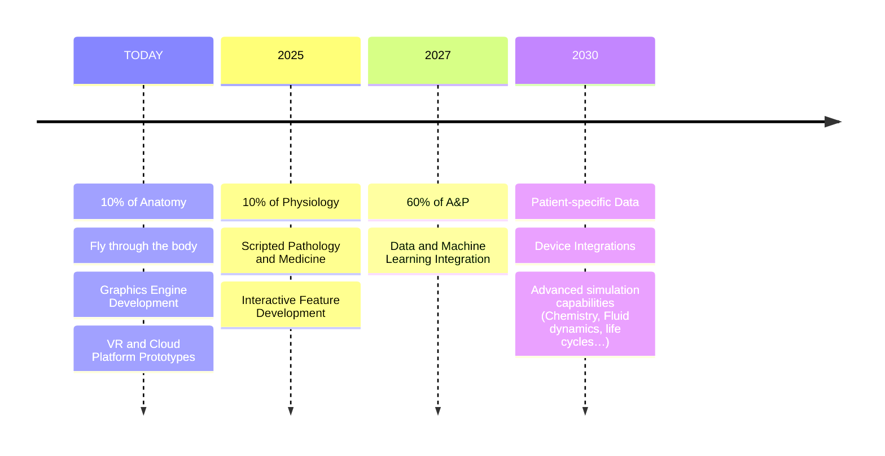

## Phases of Software Capabilities

These are the areas of focus for development, with the graphics engine as the current one.

```mermaid
graph LR

cg[Real Time\nGraphics]-->man[Manual\nData Entry]
man-->db[Database\nInterfaces]
db-->ml[Machine Learning\nGeometry]
```

## Project Roadmap to MVP

``` mermaid
timeline
section Pre-MVP<br>(Pre-Alpha)
2024<br>JAN : 3DIG : UI : Content
section MVP<br>(Alpha)
2024<br>JUN : Cloud Corpusim : Iterative<br>Development : Maintenance
section Pre-Release<br>(Beta)
2025<br>JAN : Improved PCG : Database Integration : Complete Core Functionality
section Stable Release
2026<br>JAN : Data / ML Integration : Physiology Processes. Eg, Disease : Partnerships


```

### Long Term Features Roadmap

```mermaid
timeline
TODAY : 10% of Anatomy : Fly through the body : Graphics Engine Development : VR and Cloud Platform Prototypes
2025 : 10% of Physiology : Scripted Pathology and Medicine : Interactive Feature Development
2027 : 60% of A&P : Data and Machine Learning Integration 
2030 : Patient-specific Data : Device Integrations : Advanced simulation capabilities (Chemistry, Fluid dynamics, life cycles…)
```

